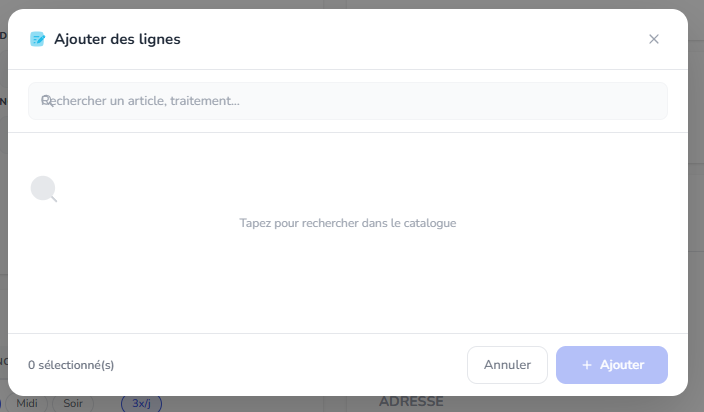
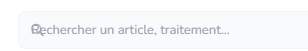
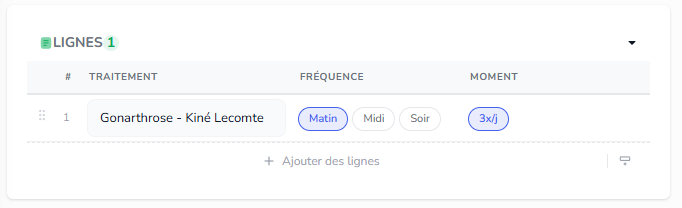
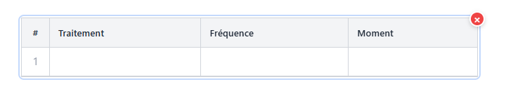
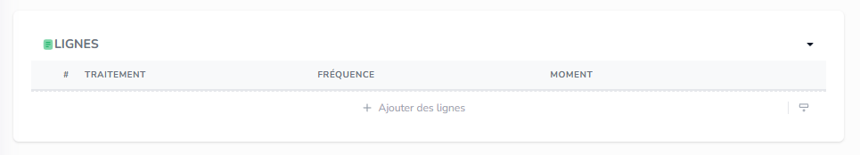
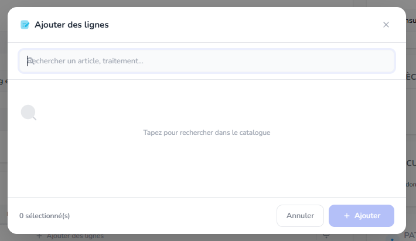
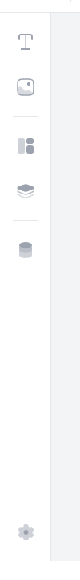
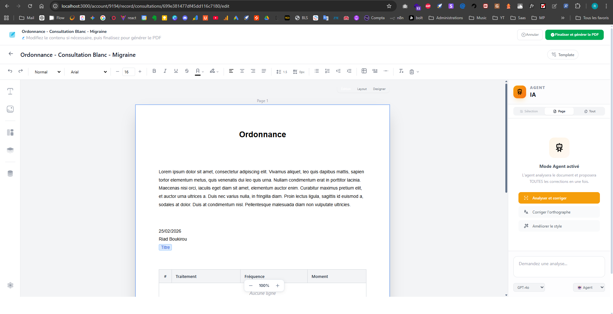

Missions du jour 

Une foie une mission terminée et pushée, barre là ici, fais un truck super beau UX/UI

Mision 1 : 

Quand on aura des element multiple a choisir, cree moi un syste de ce genre  reutilisable, via react island, je pourrais l'urtiliser ici :  ou ici  ou n'importe ou dans l'app quand c'est un besoin de choisis une ou des options,  donc comme tu voix dans l'image on peut rechercher des elemnt, ou  creer des elements ,  , , c'est important que ce soit reutilisable partout

Mission 2 : 

 Ici ajouter une ligne vide, en bas de la recherche, pour ajouter un element manuellement, avec autocomplete, fais attention  l'icon de recherche est melangé au text.

Mission 3 : 
 ici pas lignes comme header mais Traitement, si on a plusieurs tableaux lié a l'entité, alors mettre l'un en dessous de l'autre dans des panels différents.

Mission 4 :
   Pour tout les tableaux, que ce soit dynamique ou simple, il me faut un systeme pour ajouter des lignes vide en bas, ajouter des colones, resiser les colones, bg des cellule etc etc, peut etre aussi des style visuels predefinis etc, enfin un systeme complet pour gerer les tableaux.

Mission 5 : 
Pour les tableau dynamique, avoir le meme systeme qu'on a pour record pour ajouter des lignes depuis le modal, genre ici  ,  mais directement via l'éditeur.

Mission 6 :  ici dand l'editeur react et generateur de doc, mettre une toolbare plus petite avec des icon plus petites.

Mission 7:  Dans le generateur de doc, il y'a une bande un blan en bas qui n'a pas de sens, corrige ca stp