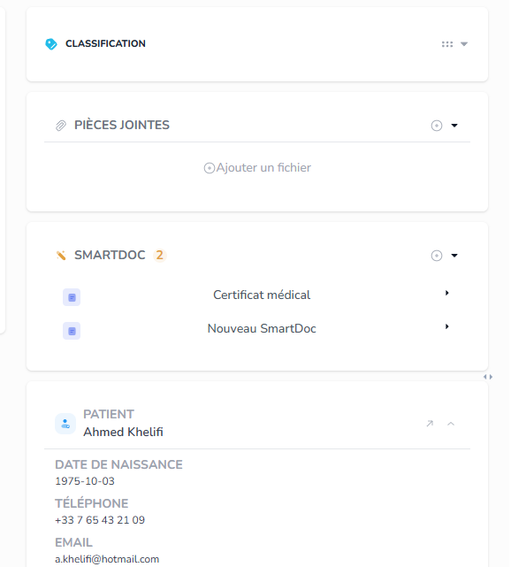
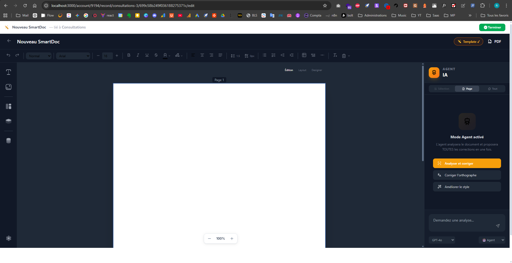
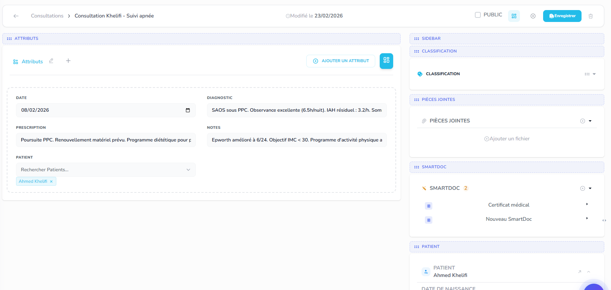

Missions du jour 

Une foie une mission terminée et pushée, barre là ici, fais un truck super beau UX/UI

Mission 6
 tout ca ici c'est pas intuitif, pour générer un document et c: je dois avoir, un boutton pour ne plus lié avec le l'entité, avec confirmation prealable et message claire, je dois aussi avoir le titre a droite, une meilleure icon qui indique que c'est un doc, un boutton générer, un boutton edit pour changer le titre par exemple ou le contenu, un boutton + plus visible avec un modal genre document simple, ou document modèle, (pour modele on met en bas réutilisable pour d'autre (patients)), je veux que le user ne change pas trop d'ecran pour arriver a travailler vite, au lieux de smart doc Tu met Documents modèles, fais moi un systeme pro, ultra UX/UI, met toi a la place d'un user il doit avoir les outils en main facilement de facon propre...

Mission 7 :

 l'editeur ne suit pas le theme dark/light , ily'a un bug

Mission 8 : 

 les elements ne sont plus draggables, il y'a un bug

Mission 9 quand on fai generé, on doit pouvoir effectué des modifs qui n'impacteront que le document en cours de generation,

Mission 10 : 
Nous devons avoir un systeme de generation de ligne, on a deja un line shema http://localhost:3000/account/9194/line-schemas , jai crée traitement schema pour test, normalement on doit pouvoir selectioner les frequences directement depuis la base de donné traitement, genre quand j'encode Doliprane, j'encode la fréquence ou les frequence pôssible, puis depuis le genrateur de ligne on doit pouvoir selectionner la fréquence, le moment, la durée etc, amis je dois avoir un systeme hybride, genre si je nai pas encodé dans le medicament je dois avoir ca depuis line schema. le generateur nous permet de creer les ligne comme pour une facture donc on aura produits et service qte..., ou pour une ordonnance on aura les traitement/frequence etc
