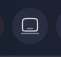
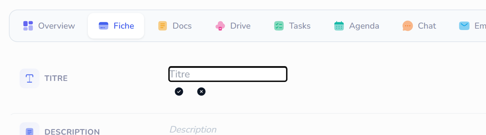
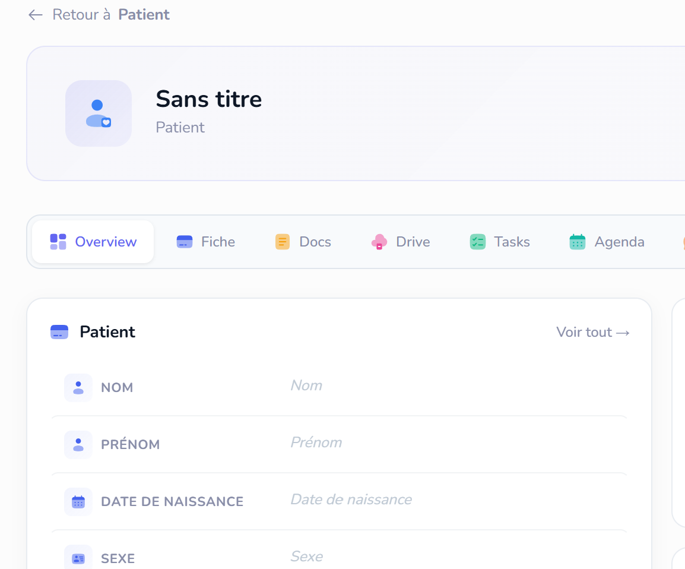

Mision 1 : Quand je suis en navigation normal (pas privée) je n'arrive pas a changer le mode light et dark, c'est touijours dark, corrige ce bug, en plus quand je toggle le mode dark light via top barre, jai comme deux mode dark, qui sont different,  celui là par exemple il n'est pas bon niveau couleur, je prefere que tout les mode sombres soit comme celui la 

Mision 2 : Travail l'agenda : http://localhost:3000/account/9194/record/patients/69ccfac0738ff763a647e29d/agenda , je dois avoir une entité systeme activable dans tout les comptes, qui s'appelle event, l'agenda va gérer les event, je peux creer different type d'event, affichage en mode agenda ou timeline ou listing ... un systeme complet d'agenda, on a deja une vue agenda par exemple ici http://localhost:3000/account/9194/record/rendez-vous/list , je veux un peu la meme chose avec drag and drop, ajout d'venement ficlement, mais aussi la possibilité d'une vue genre emploi du temps... un systeme complet et robuste, avec notif et relance aussi...

Mission 3 :  http://localhost:3000/account/9194/record/patients/69fb975ed9a96ee753d51d1b/fiche ici jai pluqieurs souci,  l'input n est pas bon niveau visuel on doit avoir la meme chose qu'ici  (c dans overview), si on peu avoir le meme design que la fiche de overview, mais exactement la meme chose, ce serait top, peut etre avoir un code reutilisable ? pour que si on fais des modifs quelques part on ne doit pas le faire dans deux endroit different...