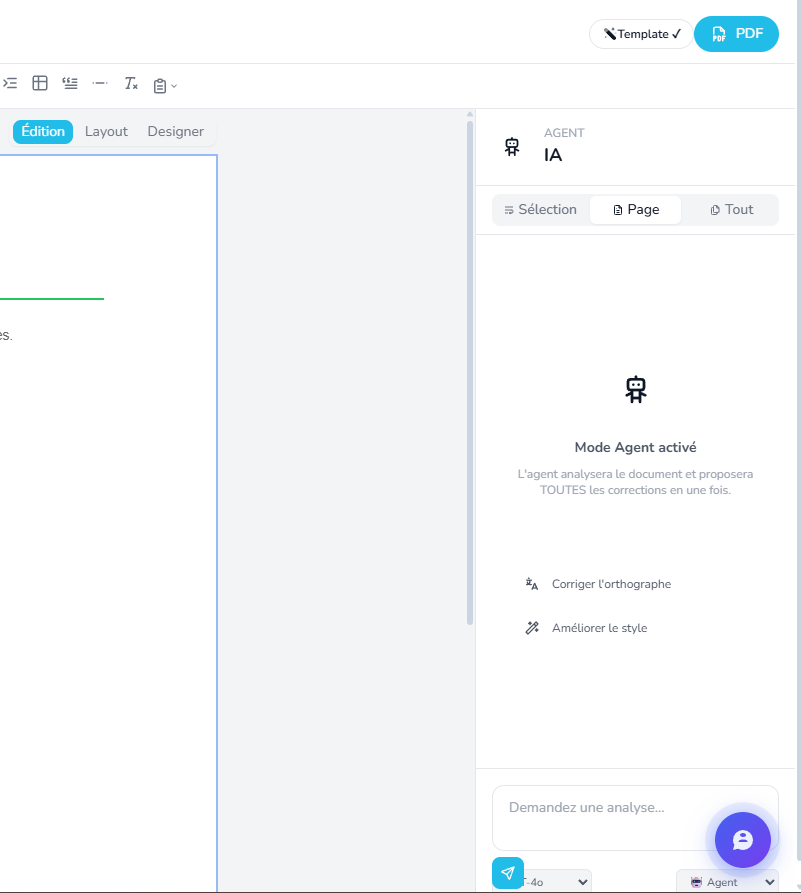
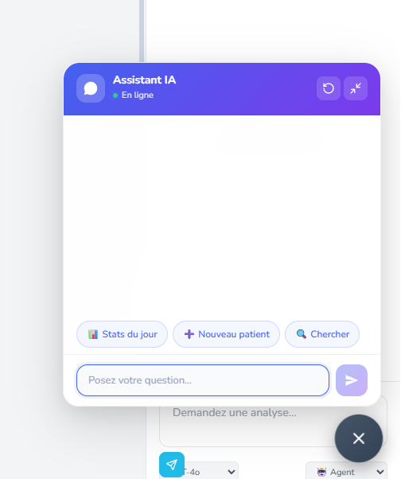
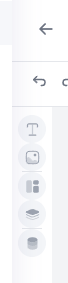
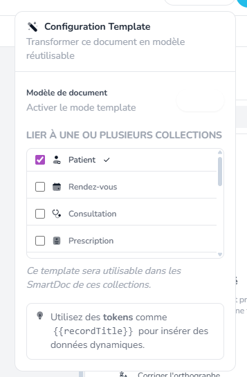
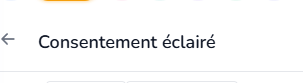
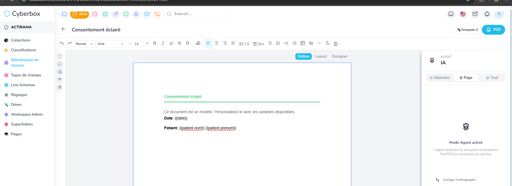
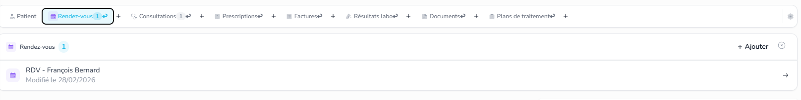

 dans le document editor la side bare IA on va la migrer vers le chat IA  , toutes les options qui se trouve dans la side bare IA on va les mettre dans le chat IA ,

 La toolbare lateral on va la agrandir un tout petit peu.

 la partie template se mettra a la place de la ou il y 'a la sidebar IA

 s'il y'a liaison avec une entité, afficher ca en bas du titre comme tag

 quand j'ouvre un doc lié a une entité la idebar ne doit pas se mettre en mode settings, garder l'affichage precedant.

Mission 2 : 

 un patient peut avoir plusieurs RDV, mais quand je sui dans patient, que je clique sur RDV, je ne peux peux pas ajouter plusieurs elle est grisé, normlamenet je peux, c One to many

