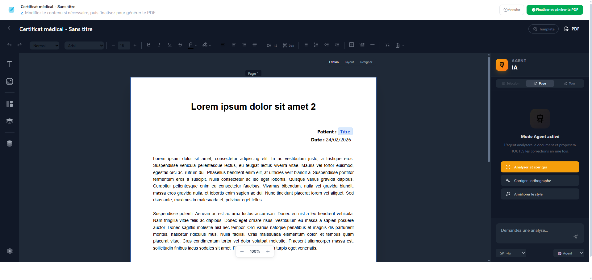
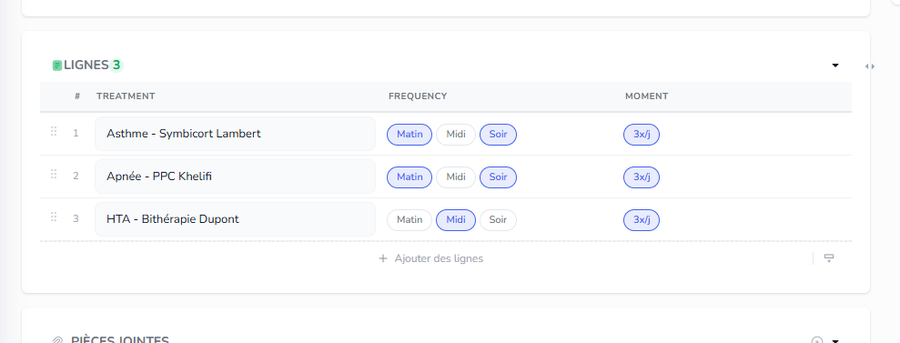

Missions du jour 

Une foie une mission terminée et pushée, barre là ici, fais un truck super beau UX/UI

~~**Mission 1** ✅ DONE~~
~~ quand je fais generé jai ca; un melange mode dark avec mode light alors que je suis surmode light~~
> 🟢 **Corrigé** — Sync thème robuste (JSON + plain string + system), Tailwind CDN `darkMode:'class'` dans l'iframe, `useDarkMode` hook mis à jour dans LeftSidebar + CanvasContainer.

~~**Mission 2** ✅ DONE~~
~~ quand je cree un template je dois pouvoir ajouter les lignes, on va appeler ca tableau dynamique, par exemple pour une ordonna que je lie a  consultation , ca dos inclure toute les lignes traitements, pour facture c produit ou services, etc, je dois avoir deux ou trois style visuel pour le tableau.~~
> 🟢 **Implémenté** — Tableau dynamique insérable depuis le sidebar "Variables dynamiques". 3 styles visuels (Minimal, Professionnel, Moderne). Résolution auto des lignes (DocumentLine) lors de la génération. API variables enrichie avec les LineSchemas disponibles.

~~**Mission 3** ✅ DONE~~

~~Si je load un evirnoement depuis nos modele predefini, ildois verifier si la collection existe deja, si elle existe il doit me propose override ou changer de slug,~~
> 🟢 **Implémenté** — Endpoint `check-conflicts` ajouté pour vérifier les slugs avant l'application d'un template. Step 3 "Résolution de conflits" dans le modal d'environnement avec choix par entité : Écraser (supprime l'existante + ses records/views) ou Renommer (suffixe auto). Boutons "Tout renommer" / "Tout écraser" pour actions rapides.

~~**Mission 4** ✅ DONE~~

~~dans le listing des entités je dois avoir le bulk select avec possibilité de supprimer plusieurs entités en meme temps.~~
> 🟢 **Implémenté** — Checkbox de sélection ajoutée au DataGrid générique (header: select all, rows: individuel). Barre d'action bulk animée avec compteur, bouton Supprimer (avec confirmation) et Désélectionner. Highlight visuel des lignes sélectionnées. Fonctionne pour toutes les DataGrid, pas seulement les entités.
