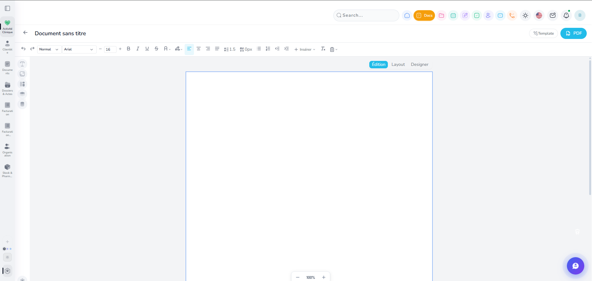
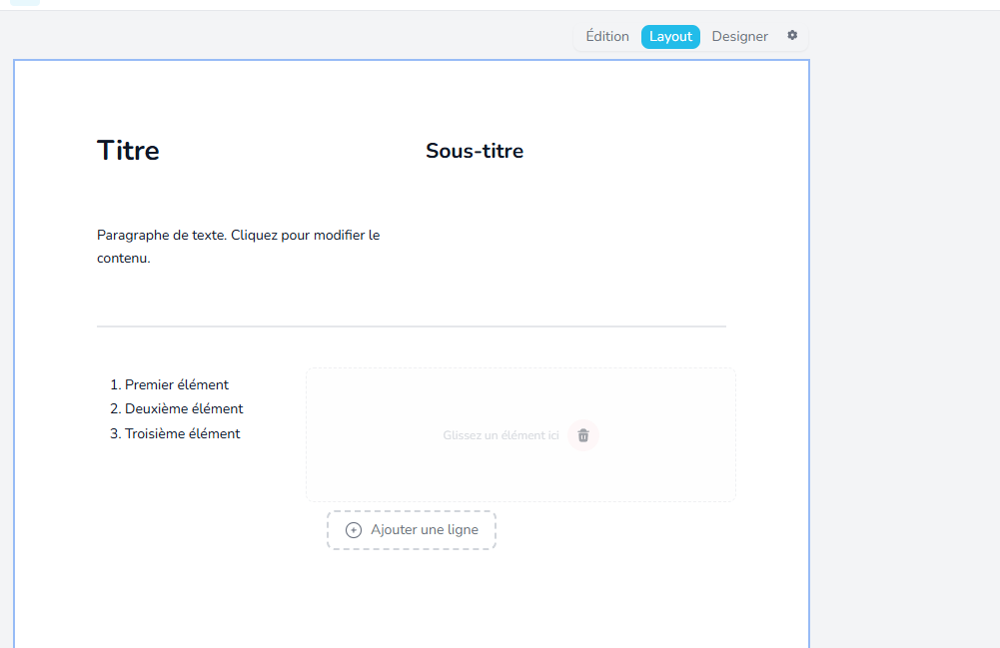

Mission 1 : http://localhost:3000/account/9194/documents/new , ici quand je fais new ou que j'edite un doc, enlever la sidebarre et topbarre completement, en rentre dans le mode focus , on rage juste le btn retour en haut à gauche,  ici corriger le switch entre mode, quand je passe de edition a layout, je dois garder le contenu, peut etre juste le convertir mais garder le contenu, genre si je suis en mode edition et que je passe en layout, mettre le contenu dans un bloque html ou trouver une solution equivalente qui preserve le design entre mode, si je suis en mulipage et que je passe en layout, les autres page en mode edition se verroue, il faut sortir du mode layout de lapage concerné pour pouvoir continuer, parce que en mode edition on a le pull content et push content, mais pas en mode layout, le verroue sert a harmoniser l'experience users... le mode designer quand a lui c un mode free style, ou il n'y a pas de border, pas de layout, tout les element je peux les deplacer avec drag and drop et ca garde la position, j'aurais aussi des calque dans ce mode...

Mission 2 : Prépare moi un plan d’architecture complet pour le système de gestion des utilisateurs, permissions, équipes, collaboration et abonnements de mon SaaS.

Le SaaS fonctionne comme un “Operational AI Workspace” orienté records/entities.
Chaque business peut créer ses propres entités métier (patients, consultations, projets, contrats, chambres, tickets, etc.) mais le système fournit par défaut :

* Documents IA
* Drive
* Tasks / projets
* Agenda
* Chat
* Email
* Notes
* Hubs globaux
* Automations
* IA orchestratrice

Le système est fortement “record-centric”.

Exemple :
Un record “Mr Chevalier” (patient) possède :

* fiche record
* documents générés (ordonnances, arrêts, rapports…)
* drive/fichiers
* tasks liées
* agenda
* notes
* chat
* emails liés
* timeline
* IA contextuelle

Chaque module possède aussi un hub global :

* chat hub
* email hub
* tasks hub
* notes hub
* documents hub

Le chat hub par exemple regroupe les conversations par record :

* Mr Chevalier

  * secrétariat
  * facturation
  * laboratoire

L’IA peut :

* résumer conversations
* suggérer tasks
* proposer documents
* analyser emails
* intervenir dans les chats
* générer synthèses
* détecter actions importantes

Je veux maintenant une architecture claire et scalable concernant :

---

1. STRUCTURE ORGANISATION / WORKSPACE

---

Je veux un système basé sur :

* Workspace / Organization
* Teams
* Users
* Roles
* Permissions
* External collaborators
* Guests

Prévoir :

* account owner unique
* admins
* managers
* members
* external collaborators
* guests/read-only

Définir :

* qui peut inviter qui
* qui peut voir quoi
* qui peut créer/modifier/supprimer
* qui peut gérer billing et abonnement
* qui peut gérer entités/templates/workflows
* qui peut gérer IA
* qui peut gérer sécurité

Je veux une architecture simple au début mais extensible plus tard.

---

2. PERMISSIONS

---

Je veux un système de permissions multi-couches :

* permissions globales
* permissions par module
* permissions par entité
* permissions par record
* permissions par champ (future enterprise feature)

Exemple :

* un freelance marketing ne voit que certains projets
* un laboratoire externe ne voit que certains fichiers
* une secrétaire voit les infos administratives mais pas certaines données sensibles
* un patient/client invité voit uniquement certains documents

Prévoir :

* RBAC simple au début
* possibilité ABAC/hybride plus tard
* héritage permissions via teams
* overrides par record
* partage manuel temporaire

Je veux aussi une stratégie UX simple pour gérer les permissions sans devenir une usine à gaz.

---

3. EQUIPES / COLLABORATION

---

Prévoir :

* teams internes
* collaborateurs externes
* invités
* partage contextuel
* accès projet/record uniquement
* mentions
* notifications
* accès cross-team

Je veux une logique moderne type :
Slack + ClickUp + Notion + Salesforce.

---

4. STRATEGIE D’ABONNEMENT / BILLING

---

Je veux une stratégie SaaS claire et intelligente.

Objectifs :

* accessible pour petits utilisateurs
* scalable pour PME
* très rentable pour enterprise
* pricing localisé par pays
* modèle psychologique logique

Je veux :

* Free
* Pro
* Business
* Enterprise

Avec :

* pricing par user
* certains rôles gratuits (guest/read-only)
* external collaborators moins chers
* addons IA
* addons automation
* addons stockage
* addons vertical packs (medical/legal/hotel/etc.)

Définir :

* quelles features doivent être core
* quelles features doivent être addons
* quelles limites mettre par plan
* comment éviter de bloquer l’adoption
* comment maximiser expansion revenue et rétention

Je veux aussi une réflexion sur :

* AI credits
* fair usage
* storage
* usage-based billing
* seat pricing
* enterprise contracts
* annual billing
* onboarding gratuit vs valeur premium

---

5. MODELE DE DONNEES

---

Prépare une proposition de data model concernant :

* Workspace
* User
* Membership
* Team
* Role
* Permission
* RecordAccess
* Subscription
* Plan
* Addon
* Usage
* Invitation

Avec relations entre modèles.

---

6. ROADMAP D’IMPLEMENTATION

---

Je veux une roadmap pragmatique :

PHASE 1 :
architecture minimale viable

PHASE 2 :
permissions avancées

PHASE 3 :
enterprise/security/compliance

PHASE 4 :
AI orchestration avancée

Je veux :

* priorités
* pièges à éviter
* dette technique probable
* simplifications intelligentes
* recommandations UX

---

7. OBJECTIF PRODUIT

---

L’objectif est que le produit donne cette sensation :

Petit utilisateur :
“wow c’est accessible”

PME :
“ça remplace 5 outils”

Enterprise :
“c’est notre OS opérationnel”

Je veux un plan cohérent produit + business + technique + UX.
