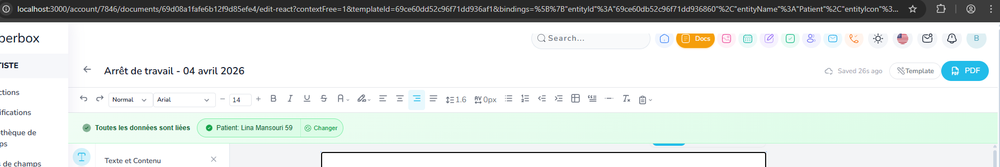
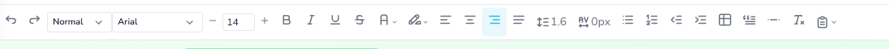
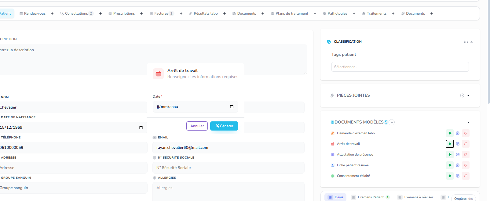
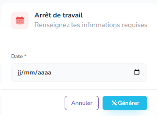

 dansla top barre avec les app, il y a une bande blanche qui coupe les icons du haut,il faut enlever ce bug css

dans le doc editor : ajouter une icon (Inserer) qui permetd'insererun tableau, une image, une check boxe, travail bien la checkboxe elle doi etre clicable , toggle cheacked, avec au hover un pointer...

,  ici il ne faut plus demanderdes infos au départ ca doit ouvrir directement le doc, et a  linterieur on ajoute date etc etc... plsu aucun doc ne demande desmodal au depart, applqiue ca a tout les seed