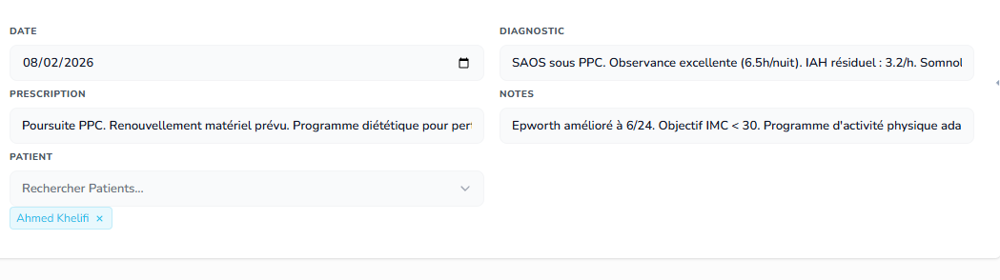

Missions du jour 

Une foie une mission terminée et pushée, barre là ici, fais un truck super beau UX/UI

~~Mission 1 :~~ ✅ DONE

~~ ici certains champ sont des text long mais en UI c des champs une seule ligne, peux tu ajouter l'option de combien de lignes afficher en text long et adapté ca en UI en conséquence~~

> **Implémenté :** Ajout du champ `ui.rows` dans le modèle FieldTemplate. Option visible dans le modal d'édition/création des champs (type `text`). Quand `rows = 1` → rendu en `<input>` single-line. Quand `rows >= 2` → rendu en `<textarea>` avec le nombre de lignes configuré. Appliqué sur record-edit + record-add (EJS + JS template).