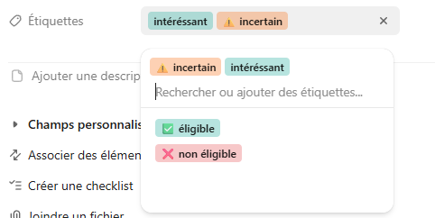
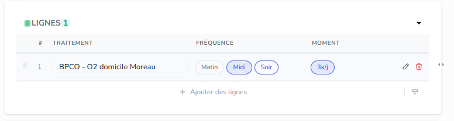
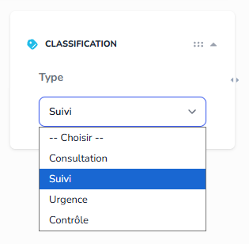
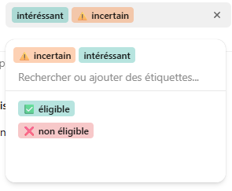
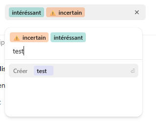
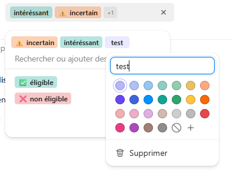
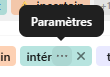

Missions du jour 

Une foie une mission terminée et pushée, barre là ici, fais un truck super beau UX/UI

Mision 1 : 

Quand on aura des element multiple a choisir, cree moi un syste de ce genre  reutilisable, via react island, je pourrais l'urtiliser ici :  ou ici  ou n'importe ou dans l'app quand c'est un besoin de choisis une ou des options,  donc comme tu voix dans l'image on peut rechercher des elemnt, ou  creer des elements ,  , , c'est important que ce soit reutilisable partout