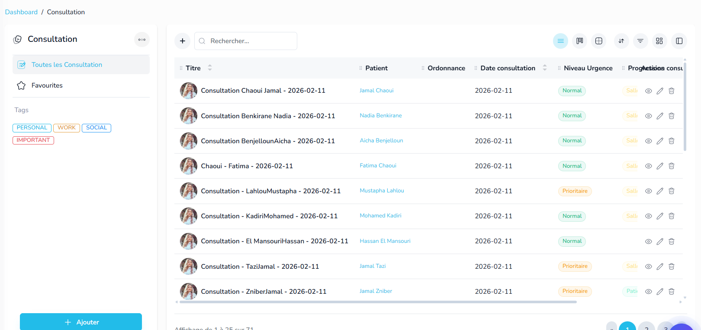
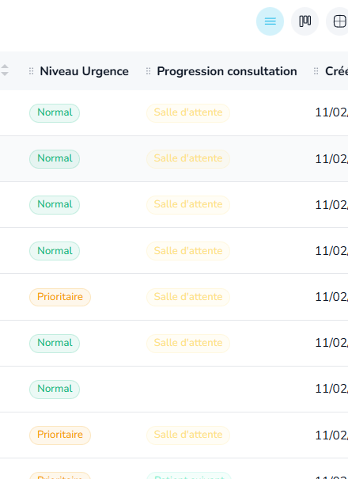
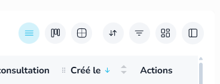

# 🚀 Autopilote — Missions

> Ce fichier est partagé entre toi et l'IA. Ajoute tes missions ici, l'IA les barre une fois terminées.

---

## ✅ Terminé

- ~~**DataGrid React Island** — Composant réutilisable (search, sort, density, colonnes, pagination, preferences serveur)~~
- ~~**Entity List → DataGrid** — Remplacement de simpleDatatables par le DataGrid island~~
- ~~**Tasks System** — Entity Tâches + seed (35 records) + classifications (Progression, Priorité, Tags) + API + DataGrid~~
- ~~**Mission 1 — Entity Settings Page** — Page full-page add/edit entity ultra UX/UI (entity-settings.ejs + controller + routes /settings & /settings/:id). Sections accordion, champs standard/personnalisés, relations, classifications, reference title tokens, preview sidebar, icon/color pickers, dark mode.~~
- ~~**Mission 2 — Icon Picker React Island** — Composant React Island pixel-perfect du IconPicker vanilla JS (src/islands/icon-picker/). Solar/MDI/Tabler, search, pagination, portal rendering, custom events pour Alpine.js integration.~~
- ~~**Mission 3 — Timeline Widgets & Widget Library** — 4 variantes Timeline (Profile, Modern, Basic, Images) en React Islands pixel-perfect + Bibliothèque de widgets drag & drop (13 widgets catalogués) pour Page Builder & Cockpit Builder. Demo page `/timeline-widgets`, API seed data, système réutilisable avec catégories, recherche, grid/list view, dark mode.~~
- ~~**Mission 4 — Calendar Widget** — Calendrier interactif React Island avec FullCalendar.js — vues mois/semaine/jour, CRUD événements via modal, badges couleur (Work/Travel/Personal/Important), légende, events seed data médicaux. Demo page `/calendar-widgets`, API route, intégré au Showcase, Vite build, dark mode.~~

## 🔲 À faire

<!-- Ajoute tes prochaines missions ici, exemple : -->
<!-- - **Nom de la mission** — Description courte -->

Tes missions sont les suivantes :

Pour toute les demande respecte le mode dark et white en gardant les class css et tailwind qu'on utilise deja, UI ultra UX, beau, stunning moderne et digne d'une app prete pour production...

 la sidebar des vue kanaban/table etc doivent permettre le filtrage en fonction des tags/classifications des records, il faut garder le style tags comme c dans la sidebar avec demo content et reproduire le meme style avec meme class css et tailwin ici  , 

Mission 2 
http://localhost:3000/account/5001/view/698afa0acca06e6fc8afbc58
 ici creer un btn config qui permet d'activer les vue dispo genre kanban, note, calendrier, tble etc, puis afficher uniquement les vue activé, toujours se rappeler de la config user, s'il active la vue kanban et qui la page, et reviens , il doit tomber sur la vue kanban pas datatable, toujours enregistrer les preference user d'affichage dans la bdd

Mission 3 
aller dans la messagerie et la rendre plus complete, je veux une messagerie robuste et complete prete a la production , tu y ajoute un endroit pour les email templates, la recherche d'email, la navigation, la possibilité d'avoir plusieurs boite mail, la signature etc etc enfin un systeme complet, tu trouvera l'html complet de la messagerie ici file:///C:/Users/pc/Documents/nodeJsProject/vristo-html-main/apps-mailbox.html , ajoute ce qui manque mais garde ce style visuel j'aime bien, resultat attendu : une boite mail stunning avec toute les options du demo de facon dynamique et pro en plus des templates et de l'ia qu on a deja, test le tout , ne test pas l'envoie de mail jsute les autres options

Mission 4 
http://localhost:3000/account/5001/view/698afa0acca06e6fc8afbc58 on va passer de ca a ca : http://localhost:3000/account/5001/patient/list , plus de vue avec id, etant donné que les vue change juste le frontend on a pas besoin den creer plein , donc quand on cree des collections a linterieur d un folder, on mettera /record/list ca cera l'url par defaut, refactorise ca meme pour les route existante, n'oublie pas de garder les preferences utilisateurs dans cette nouvelle approche, apres refresh le user garde ca disposition et config du datatable/kanban etc

Mission 5
En mode kanban, l'ajout et la modification doit se faire avec des modal quiedit et quick view, comme sur clickup, aussi afficher les tags etc dans leur couleurs et avoir style visuel top pour les card, les colone doivent avoir un max width... enfin un systeme ultra UX/UI beau visuelement, met les card en white quand c le mode light.

