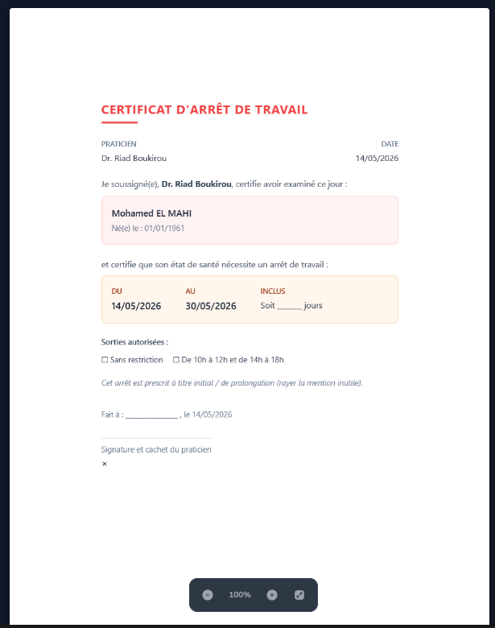
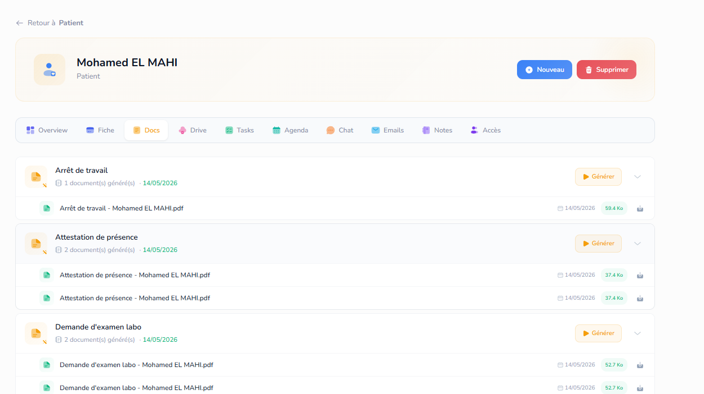

Mission 1 : http://localhost:3000/account/9194/documents/new et ici http://localhost:3000/account/9194/documents/69ccfac0738ff763a647e3ee/edit-react, ici corriger le switch entre mode, quand je passe de edition a layout, je dois garder le contenu, peut etre juste le convertir mais garder le contenu, genre si je suis en mode edition et que je passe en layout, mettre le contenu dans un bloque html ou trouver une solution equivalente qui preserve le design entre mode, si je suis en mulipage et que je passe en layout, les autres page en mode edition se verroue, il faut sortir du mode layout de lapage concerné pour pouvoir continuer, parce que en mode edition on a le pull content et push content, mais pas en mode layout, le verroue sert a harmoniser l'experience users on a deja ce systeme check l ancien code tu trouvera cette logiaue... le mode designer quand a lui c un mode free style, ou il n'y a pas de border, pas de layout, tout les element je peux les deplacer avec drag and drop et ca garde la position, j'aurais aussi des calque dans ce mode...

Mission 2 : 
 lors de la generation de doc un padding se rajoute au design automatiauement, enlever ca, il faut rester difel a ce qu on voit dans l editeur.

Mission 3 

  ici http://localhost:3000/account/9194/record/patients/6a04e0f67b394b4558fdb6e3/docs mettre une icon de pdf pour les doc generés , commencer par la date de generation, puis icon puis titre

