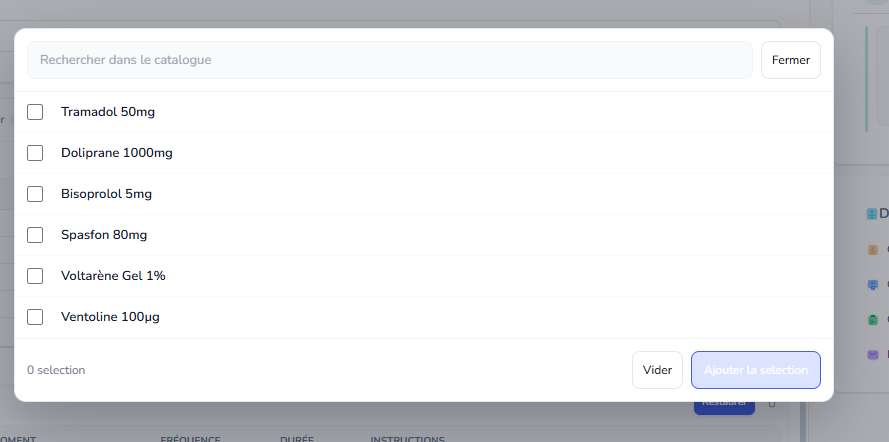
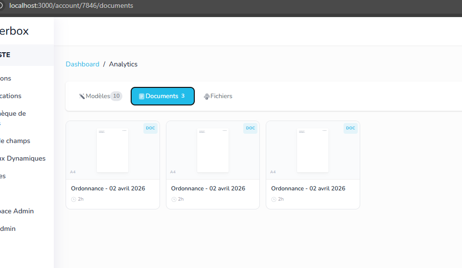

~~ici en cliquant sur catalogue ca doit ouvrir directement le modal, et les preset doivent etre dans le modal sous forme d'onglet, on aura 2 onglets, Traitement et preset...~~ ✅ DONE

~~ ici http://localhost:3000/account/7846/documents j'aimerais avoir la possibilité d'un listing sous forme de tableau, avec Nom du doc, relations, date créations etc etc donc deux views...~~ ✅ DONE

