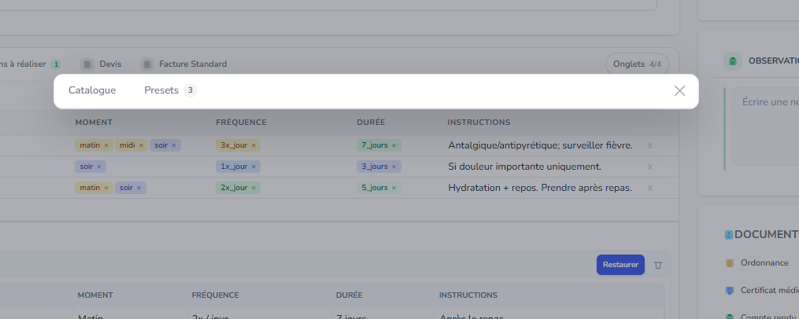
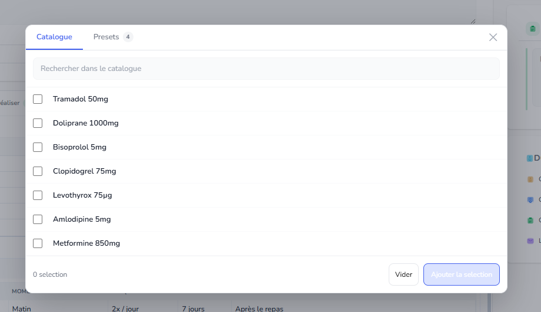
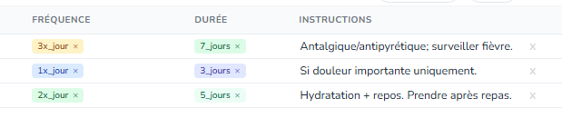
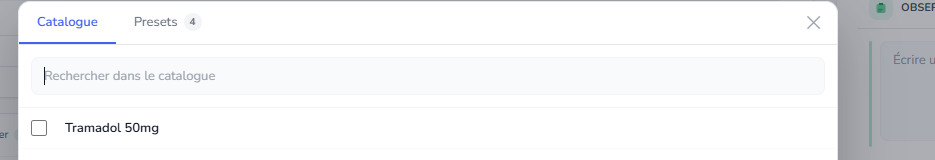
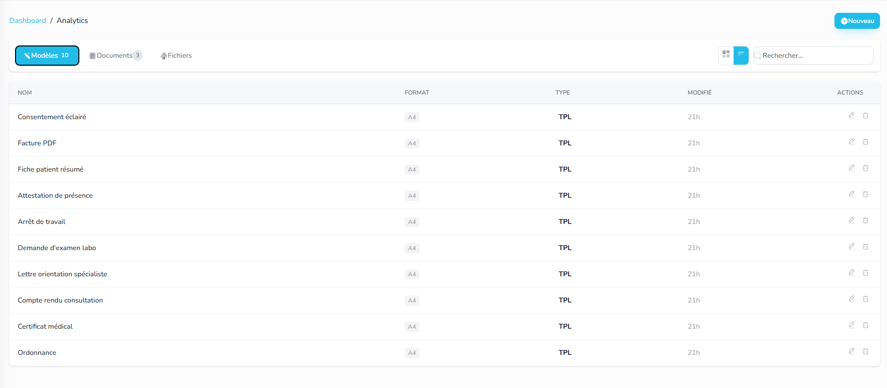
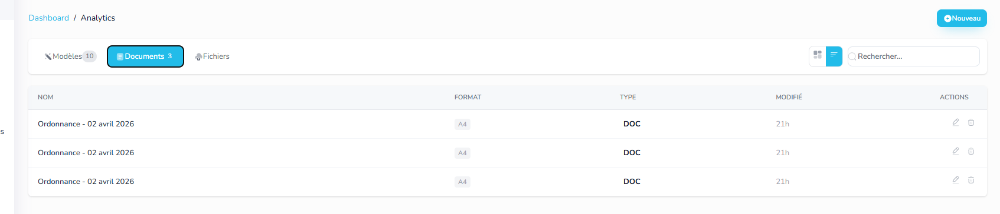

 preset affiche juste ca au début normalement ca doit afficher le catalogue en mode active

 : Je n'ai pas charger plus pour les traitement, et mettre un listing un peu plus comptacte

 quand je  load via catalogue ca affiche les slug au lieux des nom exacte

 mettre des icons a catalogue et presets

http://localhost:3000/account/7846/documents ici  : 
 Ajouter icon , ajouter relation (consultation / patient etc etc )
 Ajouter icon, ajouter relation (genre patient : LEa Leclerc), Ajouter si c'est uploadé ou généré pr un modèle