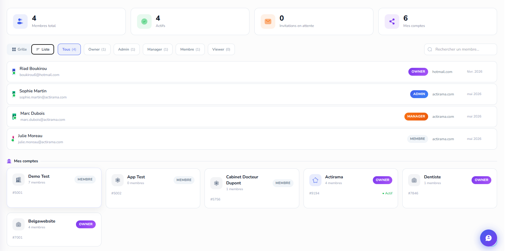

Mission 1 : http://localhost:3000/account/9194/notes ICI FAIS LA MEME CHOSE QUE LE RESTE / UN NOTE HUB comme on a fais pour chat et tasks etc... meme logique, ajouter l'option de creer une note avec mot de passe... genre un pin code.

Mission 2 :  ici mettre list par defaut pour la team , ne pas afficher les autres comptes

Mission 3 : ajouter un systeme collaboratif sofistiqué à la clickup , pour travailler ensemble, je peux alors creer des equipes de dev par exemple ou marketing au sein du meme compte, dans une conversation chat ajouter des participant de ma team ou d'autres team etc... meme chose pour agenda, partager un agenda avec un d'autres personne ou une team... un truck collabopratif complet... de l'ajout d'un membre au partage drive , permissions etc etc fais un truck robuste mais simple a utiliser et user friendly.

