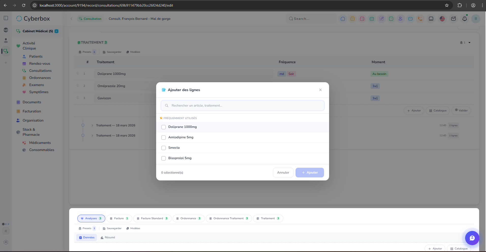
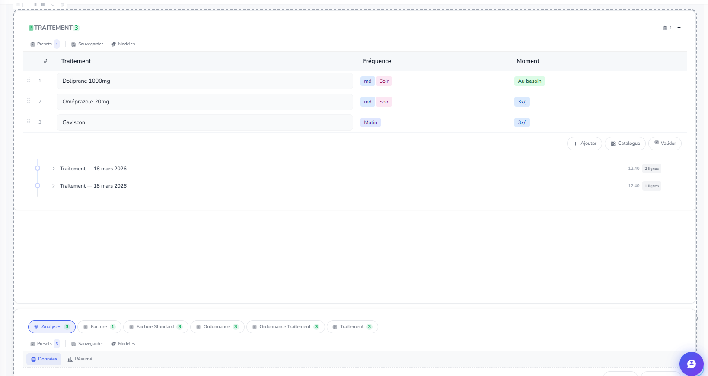
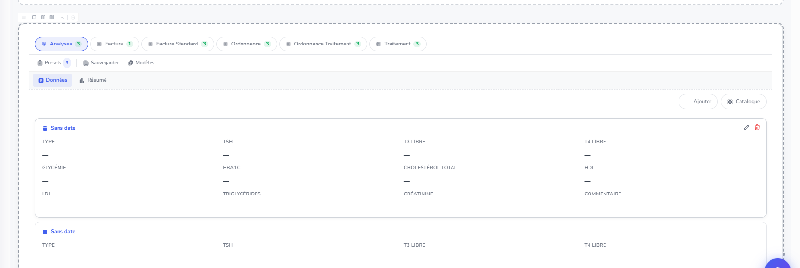

 quand le modal du catalogue est ouvert , et que je scroll, jai un panel qui n'est pas en backgroud, donc un ouci de z-index...

 je ne peux pas supprimer le panel que jai ajouté en dessous du premier panel, 

 je narrive pas a configurer le tableau dynamique pour affcher uniquement taitement ou facture comme on a fait pour le premier panel.