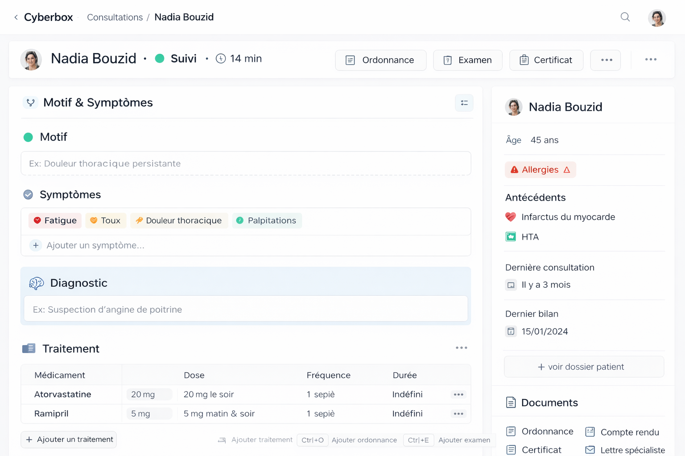
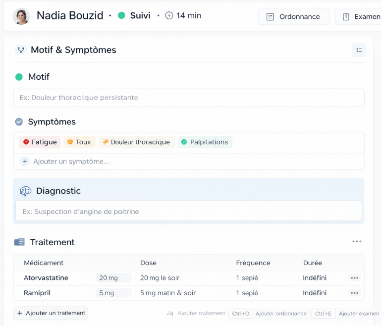
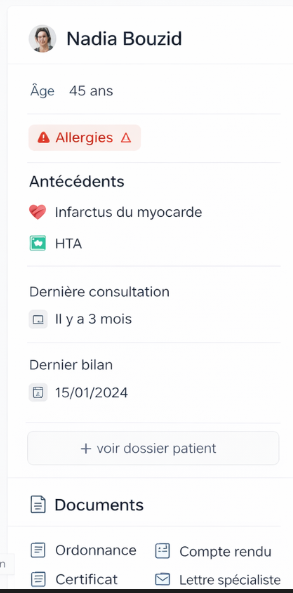

Prémission: ✅ TOUTES TERMINÉES

- ✅ image-48 : Vue compacte des champs + bouton "Ajouter un champ" → modal management terminé
- ✅ image-49 : Padding input 29px !important → terminé
- ✅ image-50 : Pas de RDV en double + groupement `pièces jointes | relations activées | Enregistrer` → terminé
- ✅ image-51/52 : Icons sans style rond, hover expandable pill → terminé

Mission 1 : 

CCheck l'image image-42.png pour comprendre le but.
 retravail moi le seed de cabinet médicale pour avoir une page comme image-42.png voila le concept 

Tout les champs auront des icons , donc afficher les icons a coté du champ.

en bas du header a gauche on aura la zone focus, qui affchichera les champs de consultation, avec leurs icon, pour les simptomes on aura un enetité symptomes, avec plein de symptomes, pour les champs de consultation on aura un champ relation, qui permettra de selectionner les symptome depuis des records de symptomes, memestyle visuel que classification, donc un champ select, avec autocomplete et possibilité de creer/modifier/supprimer ajouter des couleur enfin reutiliser le meme code pour classification

Juste apres de bloque focus consultation on aura un bloc tableaux dynamiques, qui affichera les tableaux dynamique lié a l'entité, si plusieurs on aura une sorte de tabs pour switcher entre les tableaux dynamiques...

la sidebarre droite par defaut affchera la fiche patient, la fiche patient doit etre plus pertinente regarde image 47, les champs du seed doievent etre plus intteligent, et avoir des icons, voir des couleurs, genre pour date de naissance je pourrais avoir un calcul de l'age et choisir si je dois afficher l'age ou la date de naissance... la fcihe patient de la sidebarre est crée depuis entité patient-cards, 

En bas de la fiche patient j'aurais la section documents qui affichera les docs de la consultation mais je pourrai aussi ajouter les doc du patient via config...

Donc au final on aura un pattern reutilisable, avec header custimizable, focus, tableaux dynamiques, sidebarre droite avec des fiches et des documents... priviligié les icons au lieux de labels tant qu'on peux... Champ avec render custom et calculé ... je veux un resultat pixelperfect image-42.png 
