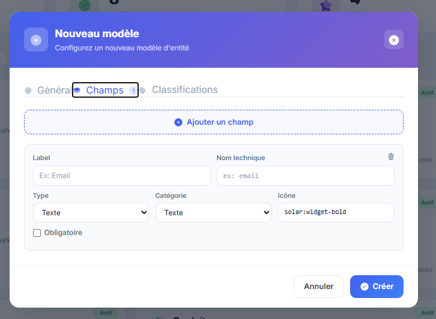

Missions du jour 

Une foie une mission terminée et pushée, barre là ici

Mission 1
ok parfait push, et voilà ma logique, dans le saas global on doit avoir des champs systemes et entity systeme qui seront activé automatiqument pour chaque nouveau user, le champssont ceux qu'on a activé pour le tenant 5001, donc enrichi moi ces champs et classes les dans des catégories bien classé comme ca en admin je peux creer des entités modèles à partir de ces champs facilement : , ensuite pour les entité systeme on aura, Documents, Tasks, projects, users, events, emails, agenda, medias, notes... tout ça bien configuré avec les relations nécessaires etc pour que ça fonctionne bien dès le départ.

~~Missions 2~~ : ✅

~~Tu fais sortir bibliothèques des champs et types des champs et lineschema de réglages et tu les mets en dessous de classifications, tu supprime Studio du menu settings~~

Mission 3 :

On va devoir créer une bibliothèque de space coté super admin, avec les entitées qui vont avec et les relations nécessaires etc pour que ça fonctionne bien dès le départ. quand un user veut ajouter un space on fait comme pour entity, on lui propose des modèles ou de partir de 0

