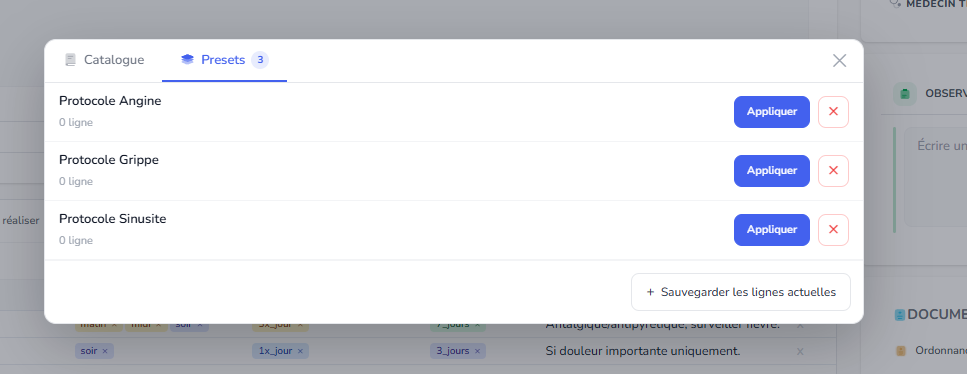
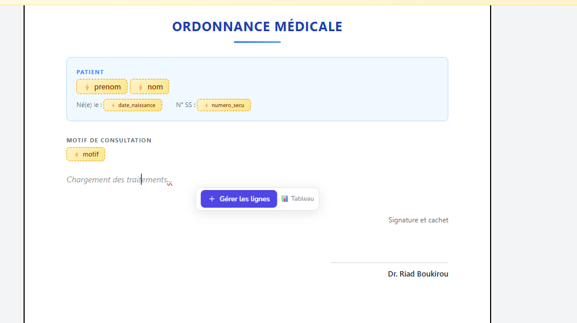

~~ ici on a toujours zero lignes, c faux il faut verifier le count~~ ✅ DONE — `preset.rows` → `preset.presetRows`

~~ ici on a chargement des traitements, enlever ca et mettre plutot un tableau avec header et une ligne vide sil est vide.~~ ✅ DONE — seed template updated with proper empty table