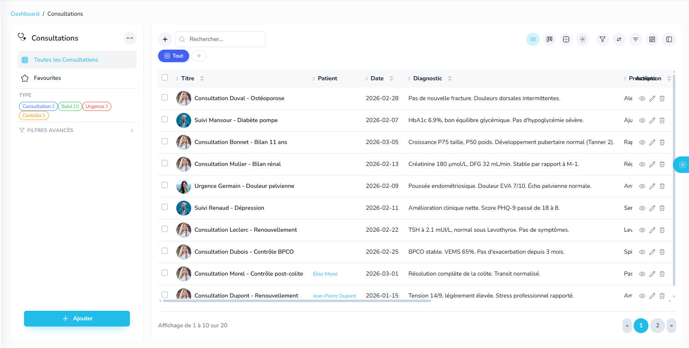

Missions du jour 

Une foie une mission terminée et pushée, barre là ici

Misison 7 :

 ici la sidbarre du datagrid, je dois pouvoir resiser son width avec souris avec min 229px et max 500px.

Enrichi le démo Cabinet docteur avec : Patients, consultations, traitements ... , met bien les relations, et démo, cree aussi un cockpit pour le médecin comme un tableau de bord ultra ux/UI, met un canal de communication avec les secretaires... un truck pro médecin...

Je veux aussi pour chaque record la possibilité de joindre des fichiers, a activé coté entity, si activé le formulaire par defaut affiche une zonne Attachements, avec liste des attachement qui peuvent etre images, pdf, word, excel, video, audio, et autre. avec aussi une partie drop file et upload files, 

une autre partie pour les records sera de générer un document automatiquement à partir d'un model, trouve un nom UX/UI accrocheur a cette partie je te donne un exemple genre pour un employé une attestation de congé sera généré en 2 clique, j'ai deja le modele lié à l'entité, je clique sur attesation de congé, il me demande la date de ... à ... et c'est bon, certain modele n'ont pas besoin de plus d'infos donc il se genereront automatiquement, les docs generé se placetront dans la partie attachements dans une section bien spécifique au doc generé, les modèles doivent donc etre capable de 'integrer aune entité et se generer facilement, si des infos obligatoire manque au model pour se generer il ffiche un modal pour demander les infos manquante, si tu voix des idées UX/UI pour cette partie n'hesite pas... 
