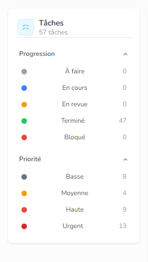
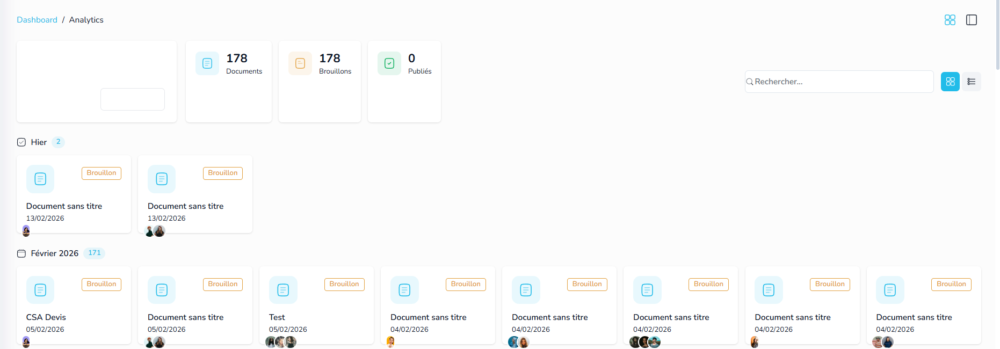

# 🚀 Autopilote — Missions

> Ce fichier est partagé entre toi et l'IA. Ajoute tes missions ici, l'IA les barre une fois terminées.

---

## ✅ Terminé

- ~~**DataGrid React Island** — Composant réutilisable (search, sort, density, colonnes, pagination, preferences serveur)~~
- ~~**Entity List → DataGrid** — Remplacement de simpleDatatables par le DataGrid island~~
- ~~**Tasks System** — Entity Tâches + seed (35 records) + classifications (Progression, Priorité, Tags) + API + DataGrid~~
- ~~**Mission 1 — Entity Settings Page** — Page full-page add/edit entity ultra UX/UI (entity-settings.ejs + controller + routes /settings & /settings/:id). Sections accordion, champs standard/personnalisés, relations, classifications, reference title tokens, preview sidebar, icon/color pickers, dark mode.~~
- ~~**Mission 2 — Icon Picker React Island** — Composant React Island pixel-perfect du IconPicker vanilla JS (src/islands/icon-picker/). Solar/MDI/Tabler, search, pagination, portal rendering, custom events pour Alpine.js integration.~~
- ~~**Mission 3 — Timeline Widgets & Widget Library** — 4 variantes Timeline (Profile, Modern, Basic, Images) en React Islands pixel-perfect + Bibliothèque de widgets drag & drop (13 widgets catalogués) pour Page Builder & Cockpit Builder. Demo page `/timeline-widgets`, API seed data, système réutilisable avec catégories, recherche, grid/list view, dark mode.~~
- ~~**Mission 4 — Calendar Widget** — Calendrier interactif React Island avec FullCalendar.js — vues mois/semaine/jour, CRUD événements via modal, badges couleur (Work/Travel/Personal/Important), légende, events seed data médicaux. Demo page `/calendar-widgets`, API route, intégré au Showcase, Vite build, dark mode.~~
- ~~**Mission 1 — Sidebar Filters** — Classification-based filtering with colored badge pills, counts, enriched classification values (label/color denormalization), all filters as tags type.~~
- ~~**Mission 2 — View Config** — Toolbar view switching (Table, Kanban, Notes), preferences persistence (viewMode saved server-side), enabled views config.~~
- ~~**Mission 4 — URL Refactoring** — `/record/:entitySlug/list` as canonical URL, no ViewID in URL, entity ID as preference key.~~
- ~~**Mission 5 — Kanban UX** — Colored columns (Niveau Urgence), classification badges on cards, QuickView modal (slide-in panel), drag & drop between columns, column max-width 320px, dark/light mode.~~

Mission de 14/02 - 01

dans la boite mail, en changeant la boite mail, l'ia ne detecte opas ca donc si je lui pose une question sur la boite actuel, elle me repond comme si j'etait encore dans la boite d'avant, met une fonction de detection du context vraiment robuste on va en avoir besoin, et fix en autopilote

Mission de 14/02 - 02
Le comportement d' l'éditeur de texte est un peu bizarre, essaire de creer un document avec les outils qu'on a en mode édition et tu vas voir : ce que j'ai decouvert c'est ca :

ctr+a + supprimer ne surpeime pas le contenu, normalement ctr+a ca doit selection tout les textes, en plus on avait galérer pour le copier coller depuis word et la detection de l'overflow pour creer de nouvelles pages en fonction du contenu, plus le comportement de tirer le contenu de la page suivante si le contenu de la page en cours diminue et plein d'autres options mais les derniere modifications que tu as fait  ont fait disparaitre tout ces options, stp essaie de retrouver les options manquantes comme on l'avais validé, check dans ta memoire , github etc etc mais il faut qu'on retrouve toutes les options validé au paravant c tres important.

également, les bloques qu'on rajoute dans le document meme en mode edition, genre citation etc, je dois avoir une petite icon delete, la comme ça impossible de supprimer le bloc, et quand je clique sur le bloque a droite je dois pouvoir mettre le curceur en dehor du bloque pour passer al la ligne suivante sans creer un espace a linterioeur du bloc, enfin ces comportement sont intuitif normalement, tu dois juste reflechir comme quelqu'un qui cree des documents stylé, il ne doit pas etre bloqué, donc stp, donne moi un systeme ready to use en v1, pret a la production, qu ipermet vraiment de creer des documents stylé et professionnel.

~~Mission de 14/02 - 03~~ ✅

~~http://localhost:3000/account/5001/tasks ici dans la vue checklist, par defaut quand on clique la checkbox ca fait decsendre en bas l'element,je ne veux pas ca, je eux deux panels, celui de droite affiche les taches terminées donc quand c checked ca va a droite en style barré, et mettre les elements dragble pour reorder,  la side barre doit avoir le style tag visuelement,~~ 

Mission de 14/02 - 04
http://localhost:3000/account/5001/documents

Ici je veux une améliorations visuelle, c trop surchargé, propose uun meilleure truck  , genre afficher des dossiers, et un dossier tout les documents et c'est lui qui sera surcharché, pou rl'organisation on peut trouver documents uploadé, modèles, documents créés, documents partagés, ou ce que tu voix d'interessant... et corrige aussi le style visuel des element qui sont completement en white...

mission 5

quand je suis en mode tactile, j arrive pas a glisser les element dragable trouve mô la meklleure facon pour gerer le drag and drop en mode tactile 