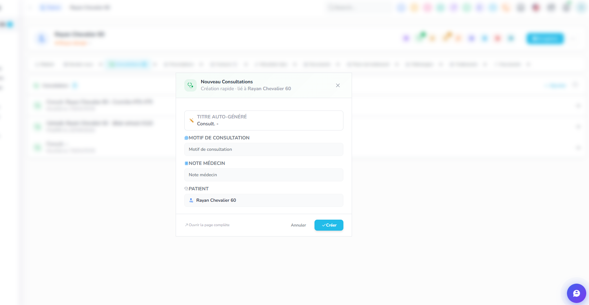

 ici la logique est la suivante : quand je cree un nouveau record a partir d une entité de lié, la liasion se cree auto c bien, mais je dois avoir une case a coché activer par defaut , redirect, si le user ne la desactive pas ca redirige vers le nouveau record edit page, genre ici dans l image si je clique sur creer ca doit creer la consult et ouvrir la page edit de la consult