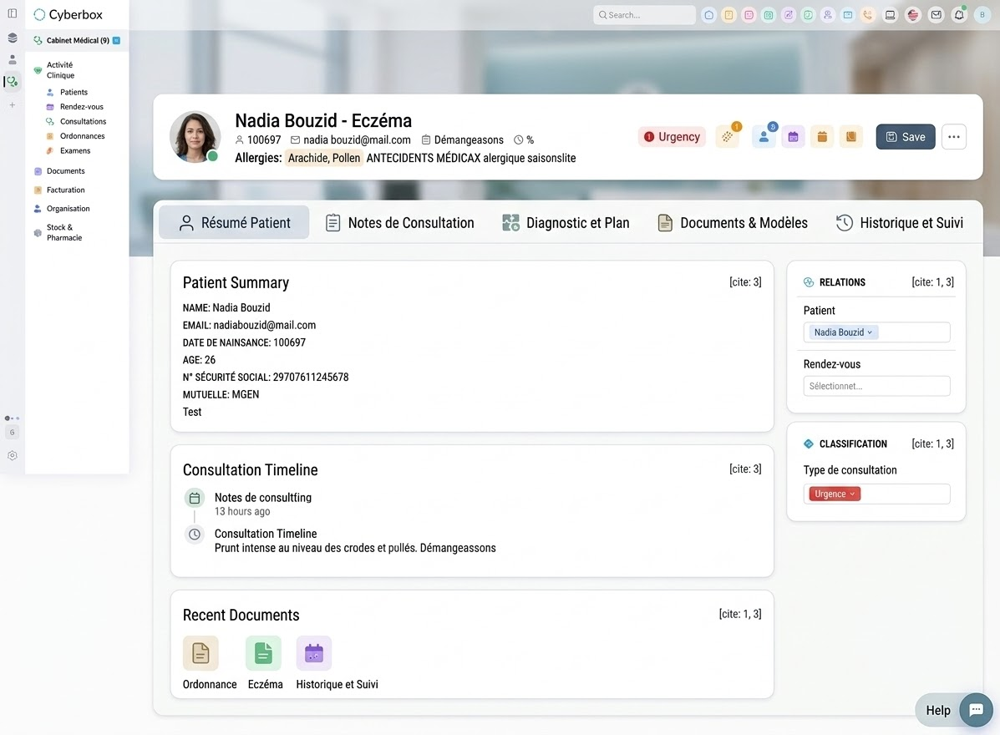
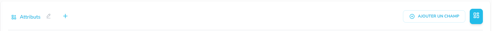
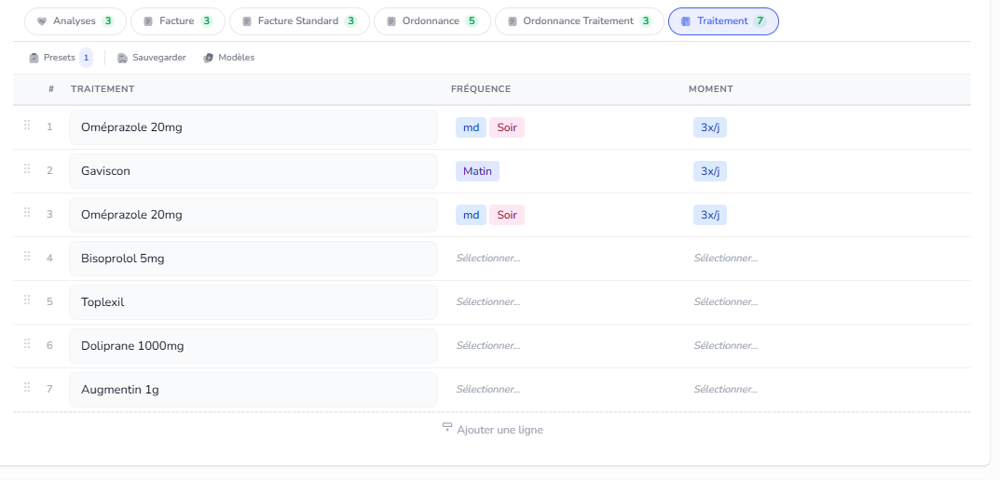

Avant de commencer cla demande suivante check toujours nos rules, les styles visuels, priviligie toujours le style qu on a deja sur le site, le design doit etre pensé mode dark et light, utilise les memes style css deja validé(check rules), fais un plan et execute le en autopilote, pour les icons genre edit/ delete / add privilie toujours line dual tole de solar avec width 24 et height 24:

http://localhost:3000/account/9194/record/consultations/69a53cfcde03671e05ed2350/edit  : pour la page records, je dois avoir un systeme de tabs comme ici pour inspiration :  par defaut la premiere tab est l'entité en cours, genre si je suis dans consultation ca affiche Consultation, on aura a coté un petit boutton plus pour creer de nouveau tabs, et en on aura automatiquement les tabs des entités liées à l'entité en cours, par exemple si je suis dans consultation, j'aurai les tabs des entités liées à consultation, comme patient, que je peux activé ou désactivé, les pj, des document et modèles... chaque tabs est personnablisable je peux y rajouté des panels, des composant etc, avec un systeme de layout flexible, ou je peux creer des colones facilement comme on a deja, mais la ce sera à l'interieur du tab en cours, memelogique avec drag and drop pour reorder, resiser cree et supprime des collones pour martcher l'espace, check notre systeme actuel dans doc editor react/ et aussi dans page builder : cockpit builder et edit page colone systeme sans oublier de checker les rules pour eviter les craches alpine/react/sortablejs, privilie toujours sortable pour drag an drop, les tabs aussi sont organisable via drag and drop...  le titre attributs sera supprimé mettre les champs directements, apres changement du layout tout doit s'enregistrer dans la base de donné, dans une partie account preferences pas juste user preferences, parce que un compte peut etre geré par plusieurs utilisateurs mais le layout des pages doit suivre le compte pas le user

---

## ✅ Réalisé

- [x] **Titre "Attributs" supprimé** — les champs s'affichent directement sans header inutile
- [x] **Custom Tab Modal** — bouton "+" ouvre un modal pour créer un onglet personnalisé (nom + icône)
- [x] **Tab Bar Drag & Drop** — les onglets sont réorganisables directement dans la barre via SortableJS
- [x] **Custom tabs persistés** — sauvegardés dans account preferences (customTabs + tabOrder)
- [x] **Custom tab content area** — contenu placeholder pour les onglets personnalisés
- [x] **Bouton × pour supprimer** — les custom tabs ont un bouton de suppression
- [x] **Fix: Drag & Drop Alpine+SortableJS** — technique "Flush & Rebuild" pour résoudre le conflit d'ordre entre Alpine.js et SortableJS lors du reorder
- [x] **Fix: Sidebar safeguard** — protection dans loadColumnLayout() pour garantir que la colonne sidebar existe toujours
- [x] **Layout par tab (Phase 1)** — Éditeur de notes riche (contenteditable) par custom tab avec toolbar (B/I/U/listes), auto-save debounced (1s), contenu persisté dans account preferences
- [x] **Per-tab field assignment** — Ré-assignment de champs du formulaire principal vers les custom tabs : bouton «+ Ajouter» avec dropdown listant les champs disponibles, rendering dans le custom tab, tags × pour retirer, persistance dans account preferences (fieldAssignments), support EJS layout + legacy Alpine builder, rebuildCanvas() côté legacy pour masquer/afficher
- [x] **Fix: Custom Tab Modal scope** — le modal ctOpen était hors du scope x-data="recordTabs()", déplacé à l'intérieur du composant Alpine pour que le bouton "+" fonctionne
- [x] **Layout par tab (Phase 2)** — Système de disposition flexible par custom tab : 3 modes (Empilé, Côte-à-côte Champs|Notes, Côte-à-côte Notes|Champs) via sélecteur "Disposition" dans le header du tab, persisté par tab dans account preferences (tabLayouts), grid-cols-2 avec overflow-hidden pour un rendu propre

## 🔲 Reste à faire

(rien pour l'instant)

## Mission du 15/03/2026 — Tableaux Dynamiques : Presets & Toolbar

### ✅ Réalisé

- [x] **Modèle GridSchemaTemplate** — Ajout `recordId`, `recordLabel`, scope `'record'` pour presets par-record
- [x] **API Backend** — `POST /api/grid-templates/save-from-record` + filter `includeRecord` dans `GET /api/grid-templates`
- [x] **Toolbar Mini** — Barre `Presets | Sauvegarder | Modèles` au-dessus du tableau dynamique
- [x] **Dropdown Presets** — Sections "Pour ce record" + "Presets globaux" avec badges de comptage, icônes colorées, suppression
- [x] **Modal Sauvegarder** — Nom, portée (Global / Record), preview des lignes, validation
- [x] **Données Démo tenant 9194** — 2 schemas (Ordonnance 6 cols + Analyses 13 cols) + 6 presets (Grippe, HTA, Douleur, Thyroïde, Lipidique, Rénal)

### 🔲 Reste à faire

- [ ] Scoper les schemas créés aux entités spécifiques (Patients, Consultations) via `/account/9194/line-schemas`
- [ ] Widget read-only pour afficher un tableau dynamique sans possibilité de modification
- [ ] Historique des records liés (affichage indirect via liaison Patient → Consultations)

Mission du 17/03/26

 dans chaque tableau je dois avoir un tn enregistrer en bas , une foie cliqué ca enregistre les données avec par defaut la date d'ajourdui, jai alors l'historique des enregistrements, les enregistrement sont lié soit au record en cour soit a une de ses relations direct ou indirect, je dois pouvoir configurer ca dans la conifig du tableau

