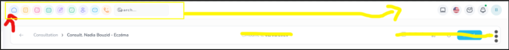
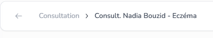
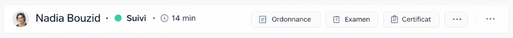

Mission 1 : 

CCheck l'image image-42.png pour comprendre le but.
 retravail moi le seed de cabinet médicale pour avoir une page comme image-42.png voila le concept :

Pour la topbarre de toute l'app, on va deplacerles icons des apps vers la droite en gardant le style coloré et expandable.
 cette partie on va la mettre a la place des icons apps, donc en haut a gauche .

On aura ensuite une barre de ce genre :  , configurable, je peux choisir quoi mettre dans la barre, la config aura la possibilité de choisir l'entité a affiché dans la barre, l'icon/avatar/ ou rien, titre de ref comme titre ou autre champ, classification simplifié, doc de l'entité choisi ou lien vers d'autres relation genre si je suis dans consultation et que je choisi d'afficher la barre patient, j'aurais les elements de consultation et le element de patient, genre je peux afficher rdv dans labbare aors que rdv est lié a patient et pas a consultation, on aura un autosave, pas de last modified, pas de public etc juste trois bouttons qui affiche les options comme supprimer, etc 

Tout les champs auront des icons , donc afficher les icons a coté du champ.

en bas du header a gauche on aura la zone focus, qui affchichera les champs de consultation, avec leurs icon, pour les simptomes on aura un enetité symptomes, avec plein de symptomes, pour les champs de consultation on aura un champ relation, qui permettra de selectionner les symptome depuis des records de symptomes, memestyle visuel que classification, donc un champ select, avec autocomplete et possibilité de creer/modifier/supprimer ajouter des couleur enfin reutiliser le meme code pour classification

Juste apres de bloque focus consultation on aura un bloc tableaux dynamiques, qui affichera les tableaux dynamique lié a l'entité, si plusieurs on aura une sorte de tabs pour switcher entre les tableaux dynamiques...

la sidebarre droite par defaut affchera la fiche patient, la fiche patient doit etre plus pertinente regarde image 47, les champs du seed doievent etre plus intteligent, et avoir des icons, voir des couleurs, genre pour date de naissance je pourrais avoir un calcul de l'age et choisir si je dois afficher l'age ou la date de naissance... la fcihe patient de la sidebarre est crée depuis entité patient-cards, 

En bas de la fiche patient j'aurais la section documents qui affichera les docs de la consultation mais je pourrai aussi ajouter les doc du patient via config...

Donc au final on aura un pattern reutilisable, avec header custimizable, focus, tableaux dynamiques, sidebarre droite avec des fiches et des documents... priviligié les icons au lieux de labels tant qu'on peux... Champ avec render custom et calculé ... je veux un resultat pixelperfect image-42.png 
