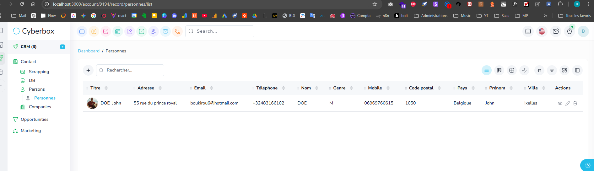
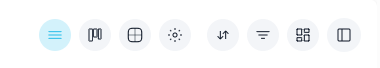

Missions du jour 

Une foie une mission terminée et pushée, barre là ici

Misison 4:

 quand je suis dans un listing de records, je dois pouvoir créer des filtres customisé et enregistré la vue avec ces filtres, dans une sorte de tabs, genre si jai des sociétés avec secteur, je dois pouvoir creer une filtre qui liste uniquement les hôtels, j'enregistre la tab comme Hotels, ensuite jai un btn plus si je veux un autre listings avec filtres, le btn filter se met a coté des autres btn  ?IL OUVRE UN MODAL AVEC LES OPTIONs de filtres, et un btn enregistrer la vue, qui ouvre un modal pour enregistrer la vue avec un nom, et un btn annuler. si tu as d'autres options à ajouter que tu trouves super interessante coté UX/UI vasy

